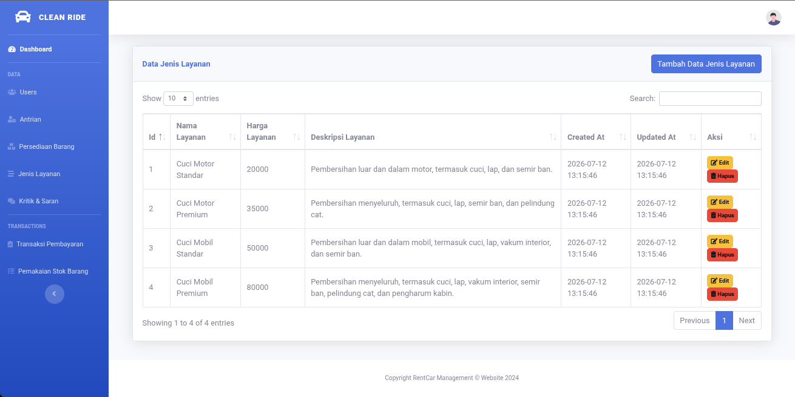

# Si Cepkin - Web Antrian Wash

## Deskripsi Sistem

**Si Cepkin** adalah sistem informasi berbasis web yang dirancang khusus untuk mengelola operasional dan antrean pada jasa pencucian kendaraan (car/bike wash). Sistem ini mempermudah pelanggan dalam mengambil antrean secara online dan membantu pengelola (admin) dalam mengatur manajemen antrean, transaksi, layanan, hingga persediaan stok barang.

## Alur Sistem (System Flow)

Sistem ini dibagi menjadi 3 hak akses (aktor) utama dengan alur kerja masing-masing sebagai berikut:

### 1. Pengunjung / Guest (Belum Login)
Alur untuk pengguna umum yang baru mengunjungi website:
* **Melihat Beranda:** Pengunjung dapat mengakses halaman utama website untuk melihat informasi layanan.
* **Kritik & Saran:** Pengunjung dapat mengirimkan masukan berupa kritik dan saran melalui form yang disediakan tanpa perlu login.
* **Registrasi (Sign Up):** Jika pelanggan ingin menggunakan layanan dan mengambil antrean, mereka harus mendaftar akun terlebih dahulu.
* **Login (Sign In):** Setelah memiliki akun, pelanggan dapat masuk ke dalam sistem.

### 2. Pegawai / Customer (Role 2)
Alur untuk pengguna yang telah login sebagai pelanggan atau pegawai penerima antrean:
* **Dashboard Customer:** Setelah berhasil login, sistem akan mengarahkan pengguna ke halaman dashboard customer.
* **Pengambilan Antrean:** Pelanggan dapat membuat pesanan baru dengan memilih jenis layanan dan mengambil nomor antrean.
* **Logout:** Keluar dari sistem setelah selesai.

### 3. Superadmin (Role 1)
Alur untuk pemilik atau pengelola utama sistem (Superadmin):
* **Dashboard Admin:** Superadmin login dan masuk ke halaman dashboard admin untuk memantau keseluruhan operasional.
* **Manajemen Antrean:** Superadmin dapat melihat seluruh daftar antrean pelanggan dan memperbarui status antrean (contoh: diproses, selesai, atau dibatalkan).
* **Manajemen Transaksi:** Setelah layanan selesai, Superadmin dapat mengelola dan merekap data transaksi pembayaran.
* **Manajemen Jenis Layanan:** Superadmin dapat menambah, mengubah, atau menghapus daftar layanan cuci yang ditawarkan beserta harganya.
* **Manajemen Inventaris & Stok:** 
  * **Persediaan Barang:** Mengelola daftar barang atau bahan baku yang tersedia di tempat cuci.
  * **Pemakaian Stok:** Mencatat setiap pemakaian barang/bahan baku untuk keperluan operasional.
* **Manajemen Pengguna (Users):** Superadmin memiliki kontrol penuh untuk melihat, menambah, atau menghapus data pengguna yang terdaftar di dalam sistem.
* **Kritik & Saran:** Superadmin dapat membaca seluruh masukan (kritik dan saran) yang telah dikirimkan oleh pengunjung.

---
